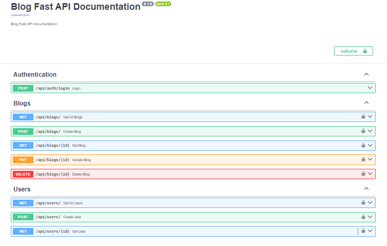

# 📔🔐 Blog with Authentication using FastAPI, SQLAlchemy, and SQLite

This application is a **CRUD (Create, Read, Update, Delete)** blog platform where users can manage their blog posts. It includes user authentication to ensure that only logged-in users can perform these operations. Built with **Python**, **FastAPI**, **SQLAlchemy** (ORM), and **SQLite** (database), this app is lightweight, fast, and easy to set up.

## Demo



## Features

- **User Authentication**: Users must sign in to create, update, or delete blog posts.
- **CRUD Operations**:
  - **Create**: Add new blog posts.
  - **Read**: View all blog posts or a specific post.
  - **Update**: Edit existing blog posts.
  - **Delete**: Remove blog posts.
- **Interactive API Documentation**: Automatically generated Swagger UI and ReDoc documentation.

## Prerequisites

Before running the app, make sure you have the following:

1. **Python** installed (version 3.7+ recommended)
2. Basic knowledge of Python and **FastAPI**
3. A code editor (e.g., VS Code, PyCharm).

## Setup and Installation

Follow these steps to set up and run the application on your local machine.

### 1. Clone the Repository

First, clone the repository to your local machine:

```bash
git clone https://github.com/melos-simeneh/Blog-with-Authentication-using-FastAPI-SQLAlchemy-SQLite.git
cd Blog-with-Authentication-using-FastAPI-SQLAlchemy-SQLite
```

### 2. Create a Virtual Environment

To avoid dependency conflicts, it’s a good practice to use a virtual environment. You can create one by running:

**On Windows**:

```bash
python -m venv venv
```

**On macOS/Linux**:

```bash
python3 -m venv venv
```

**Activate the virtual environment**:

**On Windows**:

```bash
venv\Scripts\activate
```

**On macOS/Linux**:

```bash
source venv/bin/activate
```

### 3. Install Dependencies

Install the required dependencies using the **requirements.txt** file:

```bash
pip install -r requirements.txt
```

### 4. Run the Application

Start the FastAPI server using Uvicorn:

```bash
uvicorn main:app --reload
```

The application will be available at [http://127.0.0.1:8000](http://127.0.0.1:8000).

#### Accessing the API Documentation

Once the server is running, you can access the interactive API documentation:

Swagger UI: [http://127.0.0.1:8000/docs](http://127.0.0.1:8000/docs)

ReDoc: [http://127.0.0.1:8000/redoc](http://127.0.0.1:8000/redoc)

## Contributing

If you'd like to contribute to this project, feel free to fork the repository and submit a pull request. Please ensure your code follows best practices and includes appropriate documentation.

## Thank You

Thank you for exploring this blog application! I hope it serves as a useful example for building CRUD applications with authentication using FastAPI, SQLAlchemy, and SQLite. If you have any questions or feedback, feel free to reach out.

Happy coding! 🚀
